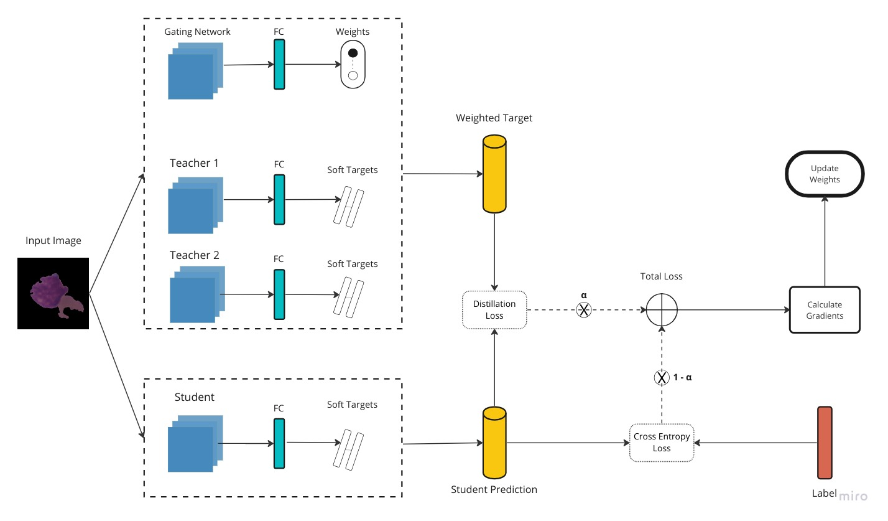

# Scalable Multi-Teacher Gated Knowledge Distillation for Accurate & Efficient Leukemia Classification

Recent advancements in deep learning have driven significant progress in medical imaging, notably in automated leukemia classification. However, deploying state-of-the-art models in real-world applications can be prohibitive due to their computational and memory overhead. In this context, this study introduces a multi-teacher knowledge distillation framework, complemented by a learned gating mechanism. This gate is designed to dynamically allocate weights to the teacher models during the distillation process, promoting accurate predictions in the student model. Swin Transformer and ConvNext models serve as the chosen teachers, with the intention to harness both the robust representational capabilities of transformers and the locality-preserving attributes of convolutions. Employing this strategy to guide a lightweight MobileNetV2 student model, an evident improvement in performance was achieved over conventional training techniques.

> Update: Extended abstract accepted in NeurIPS 2023 NewInML Workshop

## Knowledge Distillation Flow

  
    
  <!-- <i>Source: <a href="https://arxiv.org/pdf/1812.03282.pdf">Spatial-Temporal Reidentification(ST-ReID)</a></i> -->
  <i> Figure: train step for the student & gate model </i>
  

## Code

### Teacher Models Pre-Training Notebooks

- [Swin Transformer Base](./notebooks/teachers-swin.ipynb)
- [ConvNext Base](./notebooks/teacher-convnext.ipynb)

### KD Framework

- [Distillation Notebook](./notebooks/knowledge-distillation.ipynb)

### Student Standalone Training Notebook

- [MobileNetV2](./notebooks/student-standalone.ipynb)

